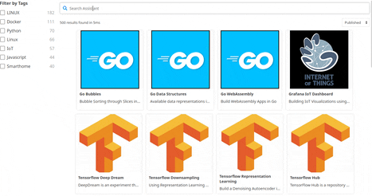

# Elasticsearch / Opensearch Reactive Interface

Using the [reactivesearch library by appbase.io](https://opensource.appbase.io/reactivesearch/) to build a search client for your own Elasticsearch / Opensearch backend:

